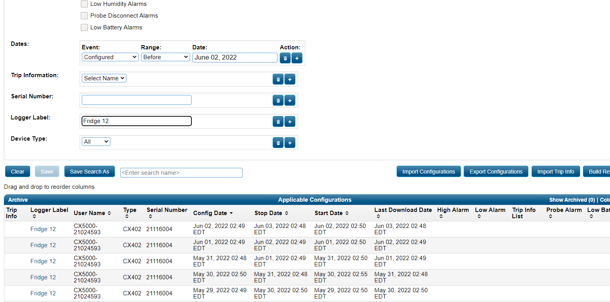
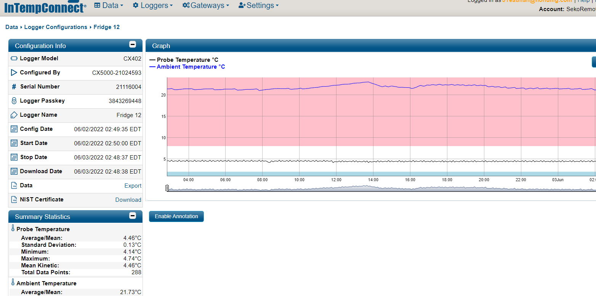
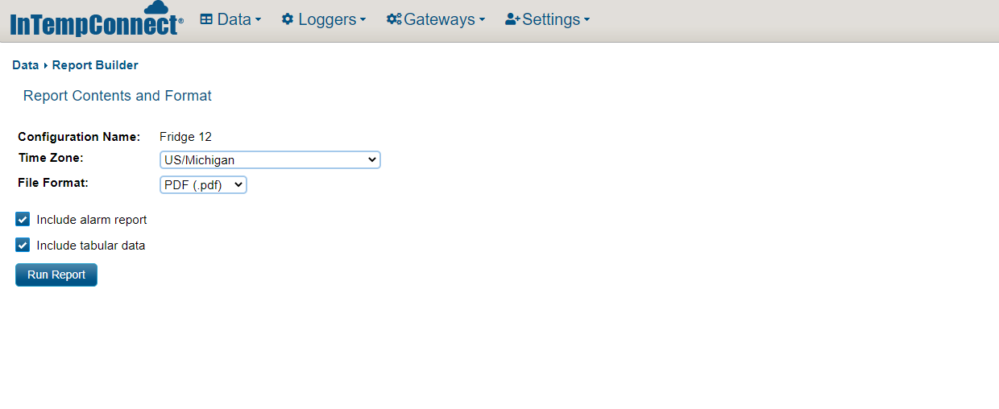
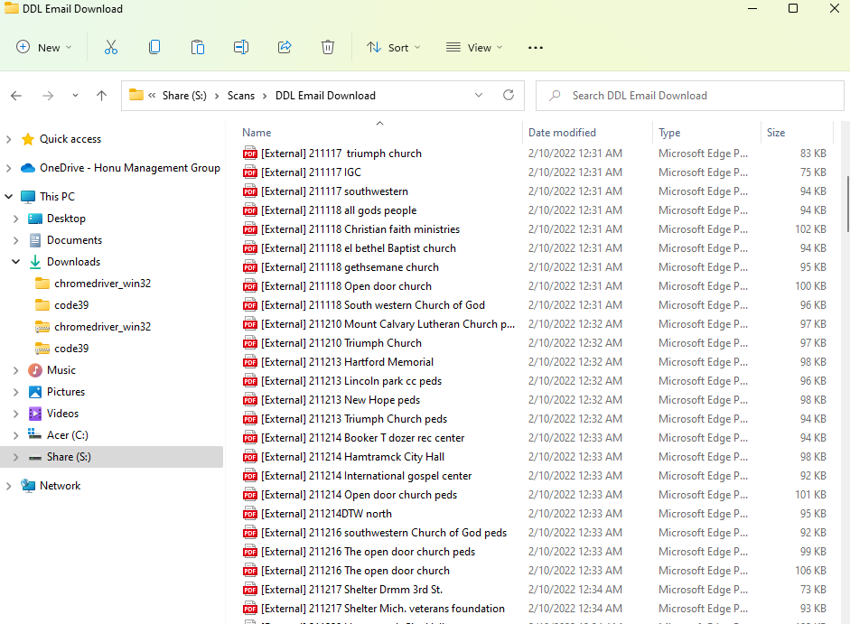
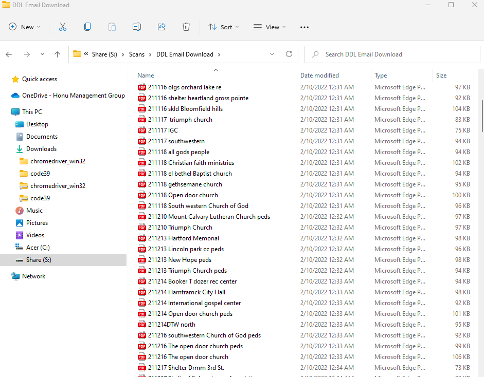
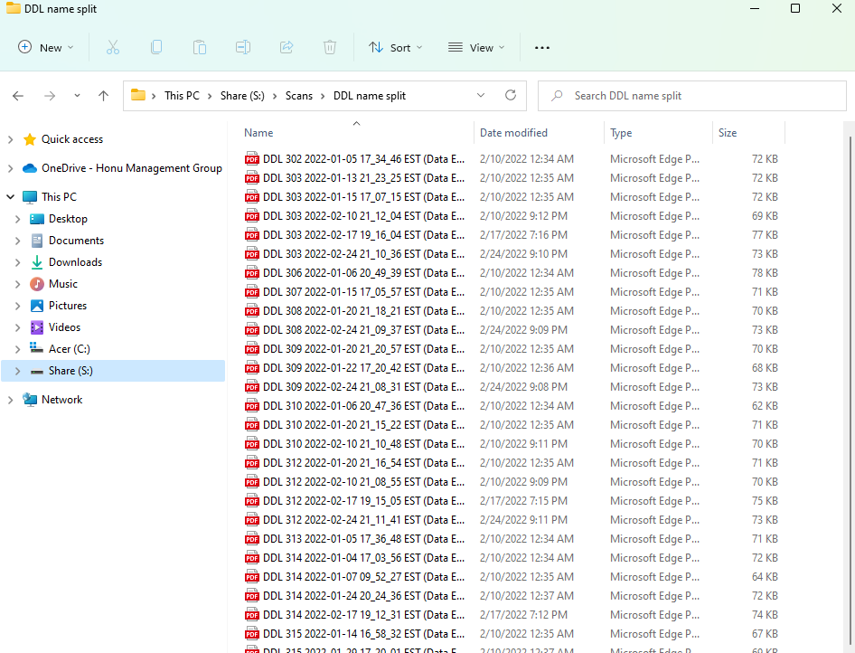
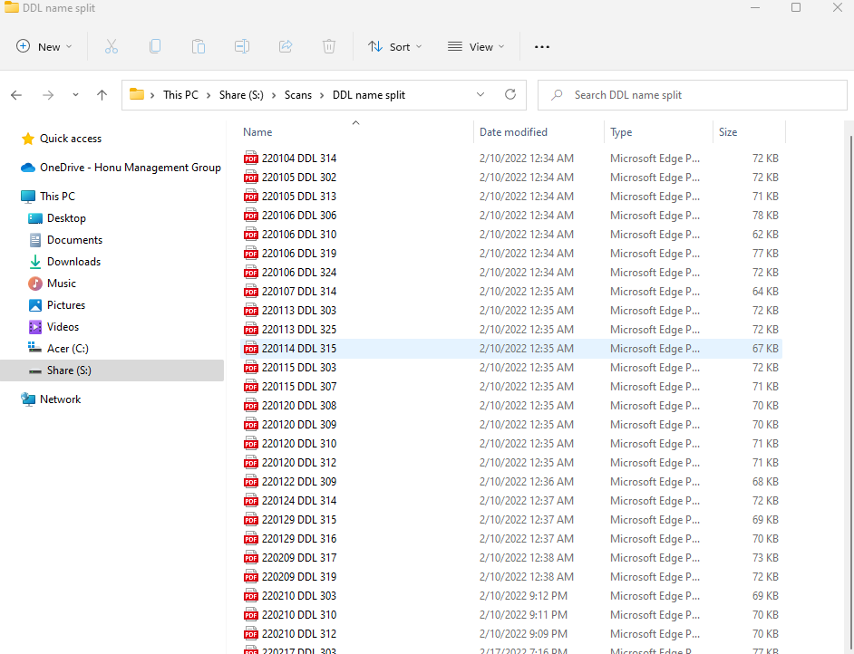
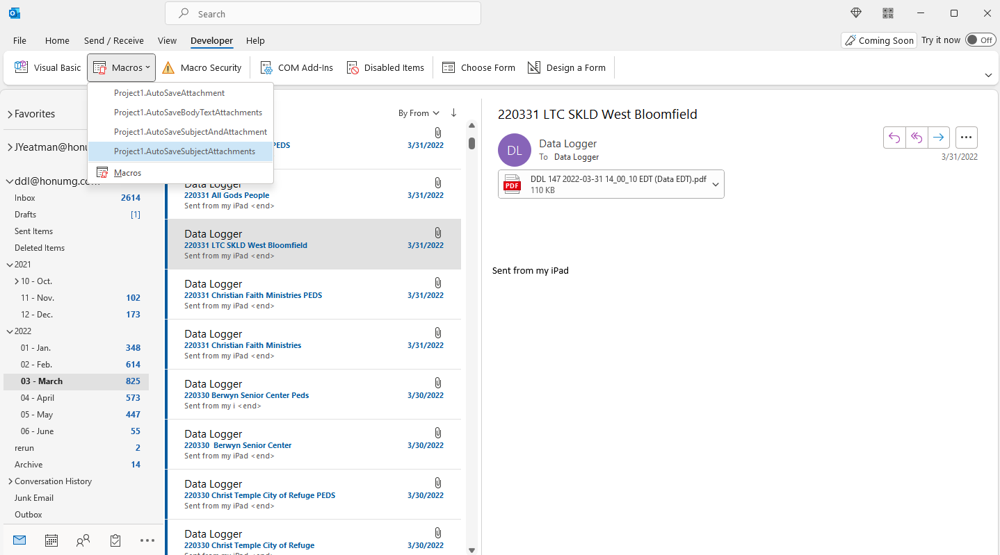

<!-- # DDL Automation Process -->

DDL Automation Process

---
 

This README Documentation was created to convey the process used to automate the DDL fridge/freezer daily downloads. Additionally this document will cover the continued support and backlog of the DDL Site download files sent to the Honu DDL email daily.

## Files included in this project:

### DDL Automation (Fridge/Freezer)
- zone_1_ddl_automation
- zone_1_ddl_renaming

### DDL Email Download File Naming
- remove_external_name
- rename_ddl_email_download
- download_name_shortener

### Email Download Automation Macros
- Download Attachment Name from Email Subject
- Download Attachment Name from Email Body Text
- Download Attachment Name from Email File Name
- Download Attachment Name from Email File Name and Subject
- Download Attachment Name from Email Subject with Special Characters

---

# zone_1_ddl_automation
 Run this file to automatically launch log in search and download all DDL reports for LDC Fridge 10, Fridge 11, Fridge 12 and Freezer 18. All files will then automatically be downloaded into the downloads folder.

 

 ---
 

 ---
 

 ---

# zone_1_ddl_renaming
(In Development)
 After running the previous file the refrigerator renaming file will then automatically rename the last four files in your downloads folder in the order they were downloaded to the appropriate responding refrigerator or freezer name.

# remove_external_name
 A large number of files were sent with a non company or external e-mail address. As a result many of the files will be saved similar to the example below. 

 '[External] 220429 Jefferson Barnes PEDS'

 

 Running this file will remove the '[External]' Section of the file.

 

 '220429 Jefferson Barnes PEDS'

 

 This script is directly targeted at 'S:\Scans\DDL Email Download' and will remove '[External]' from every file inside of the DDL Email Download folder. 

 If you run into an error it is because the file is removing the external portion and there is a file already named with an identical name. This is an easy fix simply rename the matching file something different then rerun the script.

---

# rename_ddl_email_download 
 Many files were not sent with the correct format or the corresponding site name and as a result have been downloaded with their default settings.

 'DDL 113 2022-04-10 19_29_36 EST (Data EST).pdf'

 

 Running this file will remove the excess information and place the date at the beginning so all files can still be sorted by operational date. 
 (see example below)

 '220410 DDL 113'

 

 This script is directly targeted at 'S:\Scans\DDL name split' and will reformat every file inside of the DDL name split folder.

 After running this file be sure to remove all of the renamed files. Do not re run this file again as it will restructure anything inside of the DDL name split folder. Only rerun this file if every single file inside of DDL name split folder has the original downloaded format.

 

 'DDL 113 2022-04-10 19_29_36 EST (Data EST).pdf'

 

# Email Download Automation Macros

## Download Attachment Name from Email Subject
## Download Attachment Name from Email Body Text
## Download Attachment Name from Email File Name
## Download Attachment Name from Email File Name and Subject
## Download Attachment Name from Email Subject with Special Characters

The following files represent custom VBA code that was used to generate a custom macro commands within the DDL email.

These macros are only accessible on the Outlook desktop application and you must be logged in to the DDL Email account.

To execute the macro simply select the emails you wish to automatically download attachments from and then select which macro you would like to run.

All of the files will be saved to the same location S:\Scans\DDL Email Download' Except the download by file name command. This command will save the selected email attachments directly to the name split folder. 

 S:\Scans\DDL name split'

 

