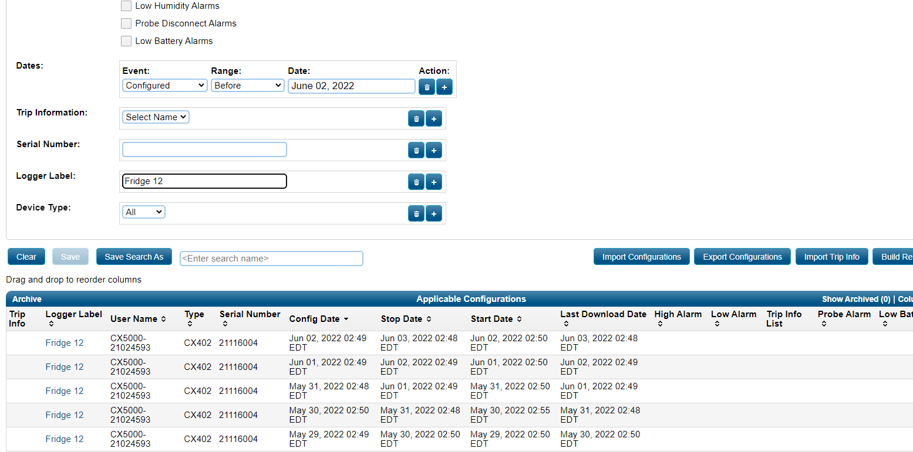
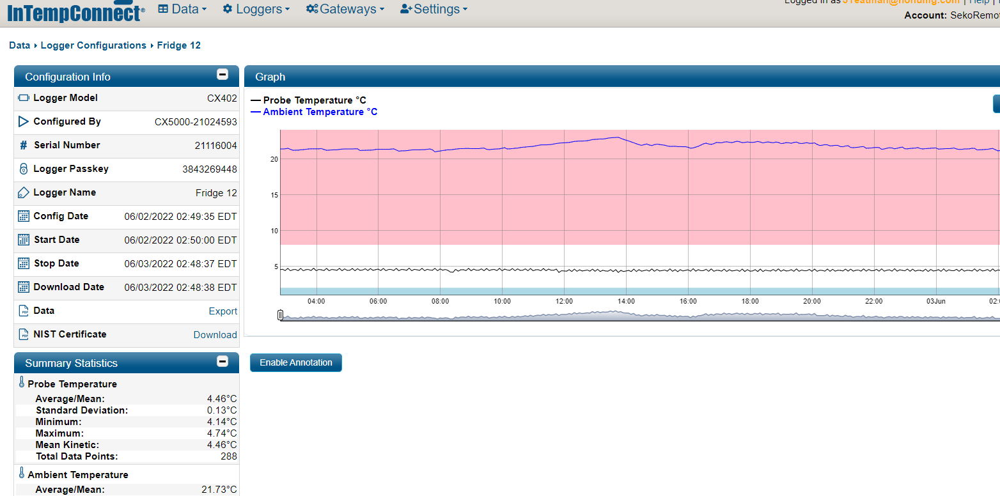
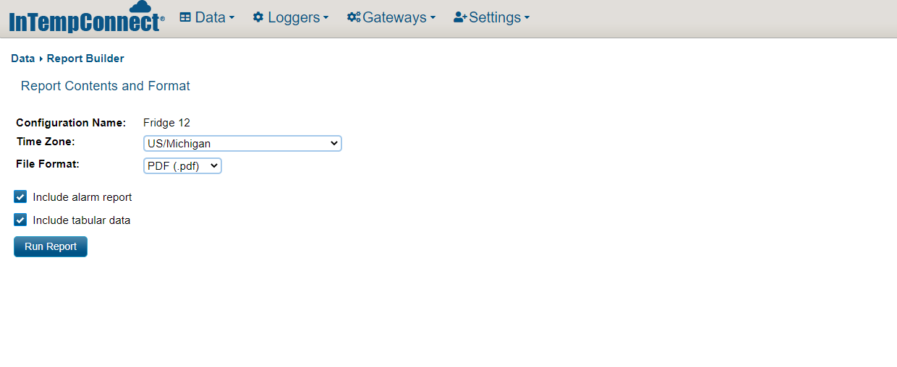

# DDL Automation process

## Files included in this project:
### DDL Automation
- zone_1_ddl_automation
- zone_1_ddl_renaming
- remove_external_name
- rename_ddl_email_download

### Email Download Automation Macros
- Download Attachment name from Email Subject
- Download Attachment name from Email Body Text
- Download Attachment name from Email file Name
- Download Attachment name from Email file Name and Subject
---

# zone_1_ddl_automation
 Run this file to automatically launch log in search and download all DDL reports for LDC Frigerator 10, Frigerator 11, Frigerator 12 and Freezer 18. All files will then automatically be downloaded into the downloads folder.

 
 ---
 
 ---
 
 ---

# zone_1_ddl_renaming
 After running the previous filethe refrigerator renaming file will then automatically renamethe last fourfiles in your downloads folderin the order they were downloaded to the appropriate responding refrigerator or freezer name.

# remove_external_name
 A large numberof files were sent with a non company or external e-mail address Because of this many of the files will be saved similar to the example below 

 '[External] 220429 Jefferson Barnes PEDS'

 Running this file will remove the '[External]' Section of the file.

 This script is directly targeted at 'S:\Scans\DDL Email Download' and will remove '[External]' from every file inside of the DDL Email Download folder 

 If you run into an error it is becausethe file is removing the external portionand there is a file already named with an identical name. This is an easy fix simply renamethe matching file something different and a rerun the script

# rename_ddl_email_download
 Many files were not sent with the correct format orthe corresponding site nameand as a result have been downloaded with their default settings.

 'DDL 113 2022-04-10 19_29_36 EST (Data EST).pdf'

 Running this file will remove the excess information and place the date at the beginning so all files can still besorted by operational date 
 (see example below)

 '220410 DDL 113'

 This script is directly targeted at 'S:\Scans\DDL name split' and will reformat every file inside of the DDL name split folder

 After running this file be sure to remove all of the renamed filesand. Do not re run this file againas it will restructure anything inside of the DDL name split folder. Only rerun this file if every single file inside of DDL name split folder Has the original downloaded format.
 'DDL 113 2022-04-10 19_29_36 EST (Data EST).pdf'

 # Email Download Automation Macros

## Download Attachment name from Email Subject
## Download Attachment name from Email Body Text
## Download Attachment name from Email file Name
## Download Attachment name from Email file Name and Subject

The following files represent custom VBA code that was used to generate a custom macro commands within the DDL email.

These macros are only accessible on the Outlook desktop application And you must be logged in to the DDL Email account

To execute the macro simply select the emails you wish to automatically download attachments from and then select which macro he would like to run

All of the files will be saved to the same location ;;; Except the download by file name command will save it to the name split folder